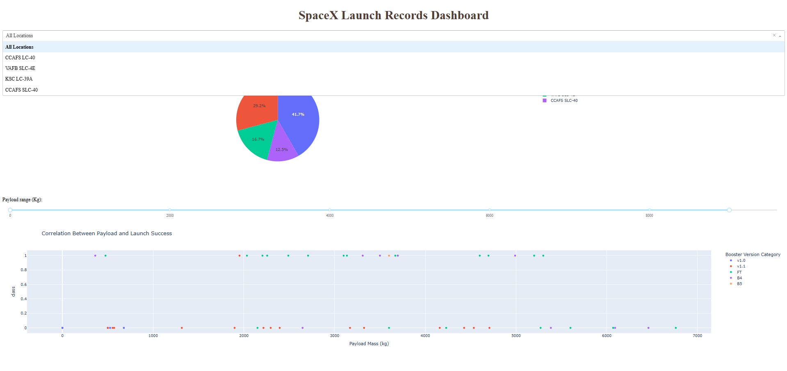
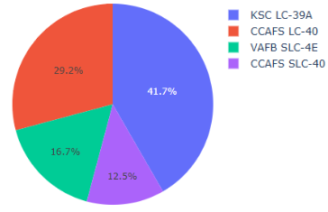
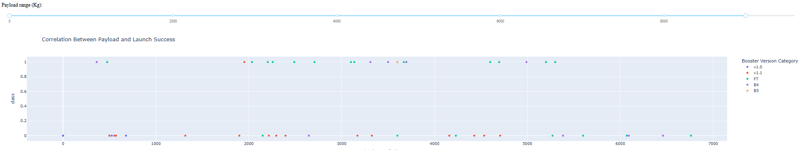
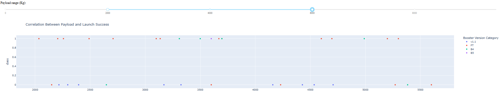

# Falcon 9 First Stage Landing Prediction 🚀

This project aims to predict the successful landing of the Falcon 9 first stage booster using historical SpaceX data. It is the final capstone project for the IBM Applied Data Science course.

## 📊 Overview

- **Goal**: Predict if a Falcon 9 first stage will land successfully
- **Technologies**: Python, Pandas, SQL, Matplotlib, Seaborn, Folium, Plotly, Scikit-learn
- **Data Sources**: SpaceX API, Wikipedia (web scraping)
- **Models Used**: Logistic Regression, SVM, Decision Tree, KNN
- **Extras**: Interactive dashboard and map visualizations

## 📁 Project Structure

- `notebooks/`: All project notebooks from data collection to model evaluation
- `data/`: Datasets used/generated in the project
- `presentation/`: Final project presentation (PDF)
- `images/`: Visualizations used in slides
- `README.md`: Project overview

## 🧠 Highlights

- Built a full ML pipeline from raw data to predictions
- Created an interactive dashboard and map
- Achieved 84% accuracy with SVM

## 🖼️ Dashboard Screenshots

### Full Dashboard View

### Pie Chart - All Sites

### Pie Chart - One Site Selected

### Scatter Plot - Full Payload Range

### Scatter Plot - Filtered Payload (2000–6000 kg)

## 📎 Final Presentation (PDF)
🔗 [View the presentation here](./presentation/Presentation.pdf)

---
